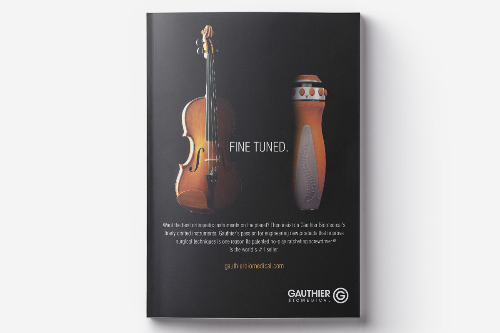
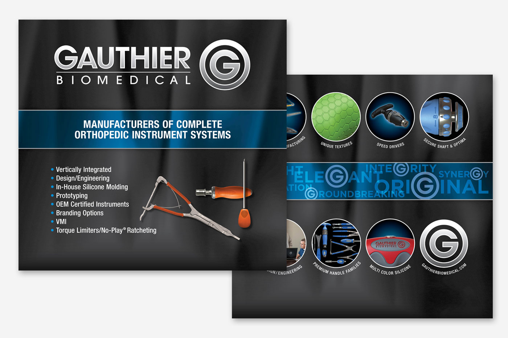
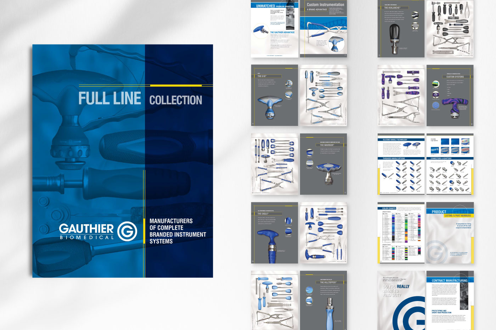

<is-land on:visible>

## Print Collateral

# Catalog, Tradeshow Signage, + Print Ads

* Print Ad Campaigns
* Print Collateral
* Tradeshow Signage

## Overview
			
I was a part of the team that designed Gauthier Biomedical's print catalog, and created several of their print advertising campaigns. We also created their tradeshow signage.

</is-land>

	<is-land on:visible>
		
	</is-land>
	<is-land on:visible>
		
	</is-land>
	
		<is-land on:visible>
			
		<is-land on:visible>
	

