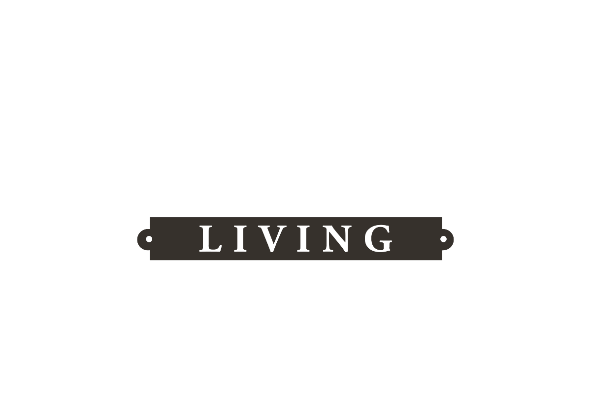
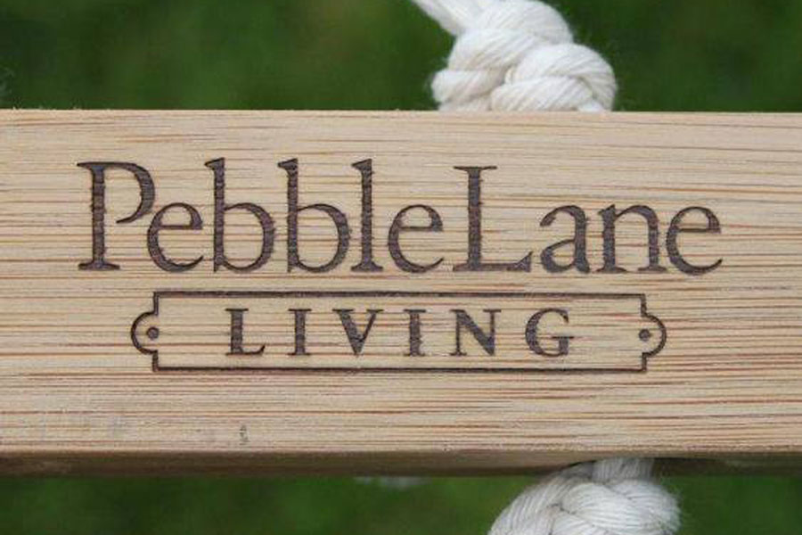
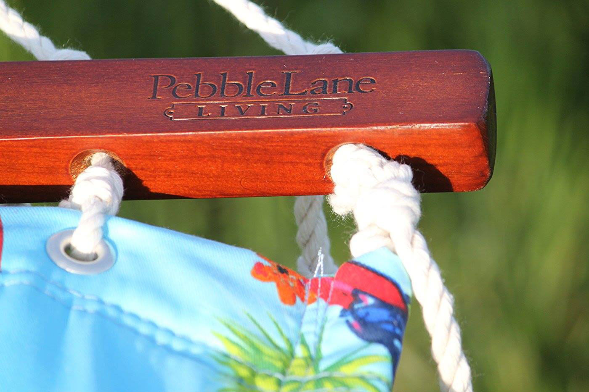

<is-land on:visible>

## Visual Branding

# Web Design, Development, + Logo Design

* E-Commerce Theme Development
* E-Commerce App Customization
* Logo Design

## Overview
			
Pebble Lane was primarily a furniture retailer that has since been absorbed by [Smart Living Home & Garden](https://www.alexkademan.site/work/smartlivinghg/).

I built this website using a now-defunct shopping cart program, and maintained it for several years before it was shut down.

Also I created the logo and managed all branding for the website and all of it's print needs during it's several year run.

</is-land>

	

		

			<is-land on:visible>
				
			</is-land>	
		

		

			<is-land on:visible>
				
			</is-land>
		

		

			<is-land on:visible>
				
			</is-land>
		

	

