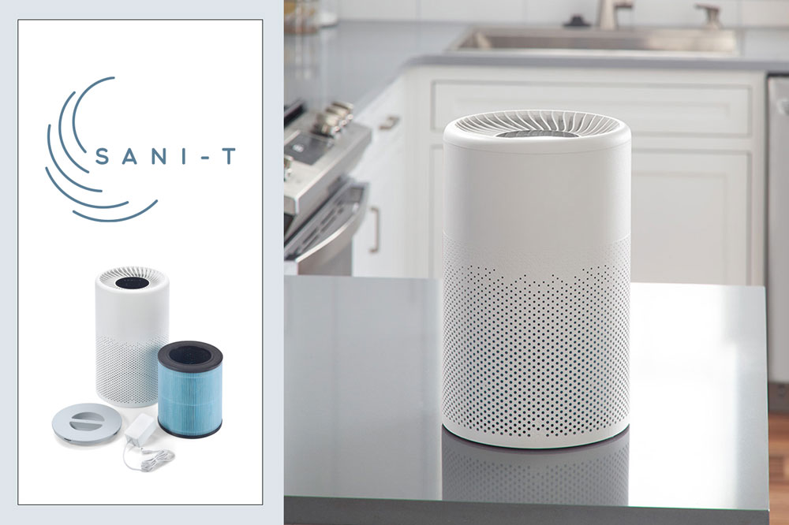
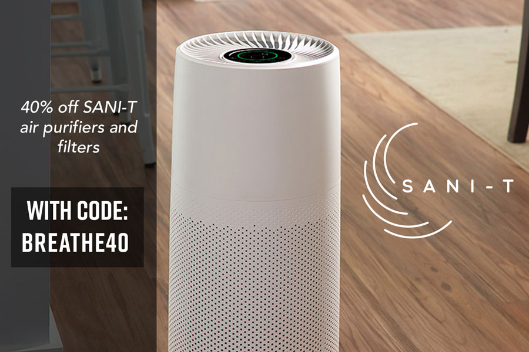
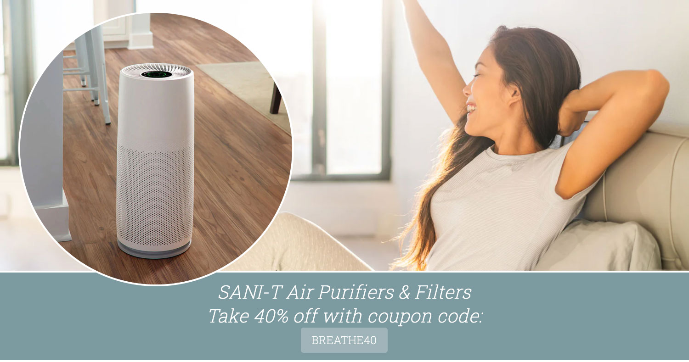

<is-land on:visible>

## Lead Designer

# Logo Design, + Branding

## Overview

We at Smart Living Home & Garden developed a line of air purifiers. My responsibility was to develop an effective advertising push to get it into the wild. The look was kept light, breezy and clean, with a spiral motif to evoke the flow of clean air.

</is-land>

	<is-land on:visible>
		
	</is-land>
	<is-land on:visible>
		
	</is-land>

	<is-land on:visible>
		
	</is-land>

 
