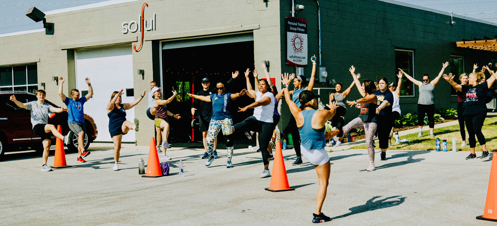

<is-land on:visible>

## Lead Designer

# Web Design

* Web Development
* Web Design

<a href="https://www.solfulfitness.com/" target="_blank">
	<button>Visit Website</button>
</a>

## Overview
			
Solful Fitness is a website that I have designed and maintained for almost my entire career. It has gone through may iterations, and spanned several different CMSs.

These days it is hosted as a squarespace theme that has caused me no small ammount of stress to keep everything working within the confines of Squarespace's walled garden. 

Still, the client is always right, and they appreciate what squarespace has to offer.

After all of the different versions, the site has never looked better.

</is-land>

	
		<is-land on:visible>
			
		</is-land>
	

